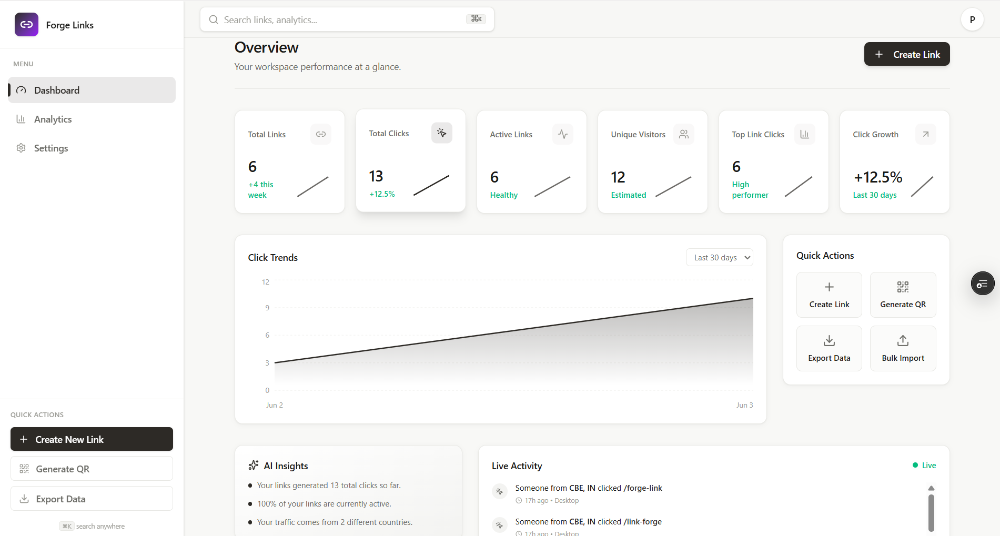
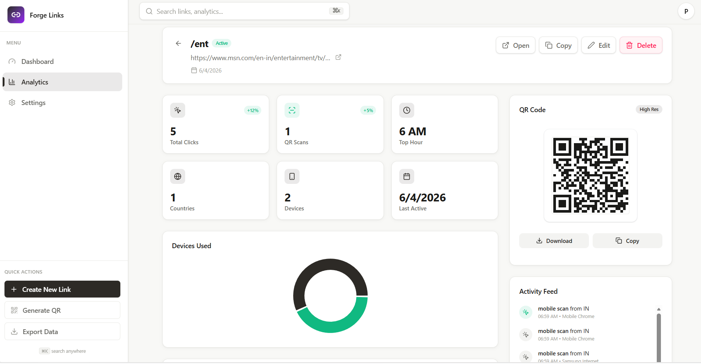
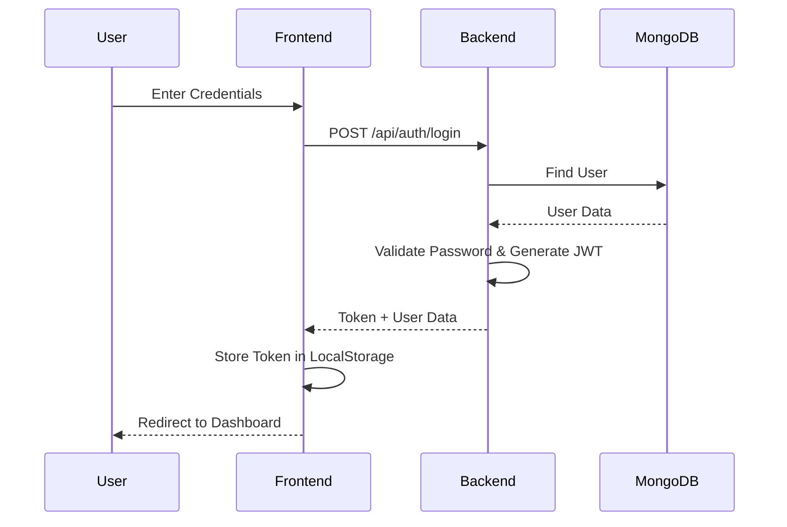
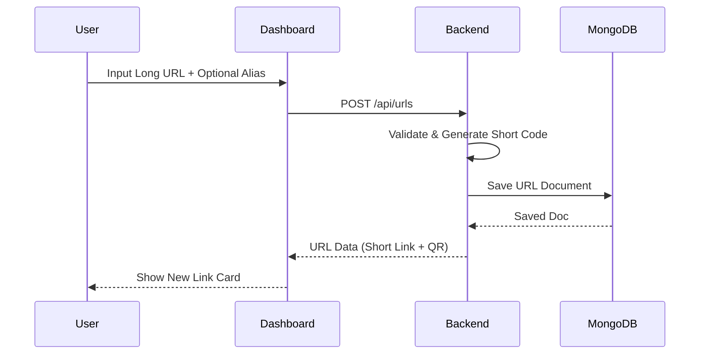
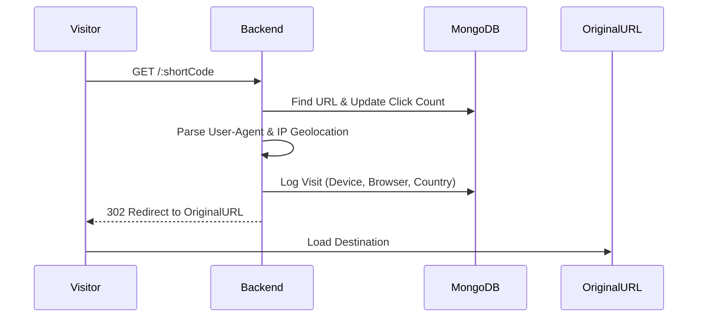

<div align="center">

# 🔗 Forge Links

**The Next-Generation URL Shortener & Analytics Platform**

[](https://vitejs.dev/)
[](https://reactjs.org/)
[](https://nodejs.org/)
[](https://www.mongodb.com/)
[](https://tailwindcss.com/)

---

### 🚀 Live Application
**[Visit Forge Links](https://linkforge.vercel.app)**  
*Modern. Fast. Reliable.*

[Demo Video](#-demo-video) • [Features](#-key-highlights) • [Architecture](#-architecture) • [Deployment](#-deployment)

</div>

---

## 📖 Project Overview

**Forge Links** is a professional-grade SaaS platform built to transform how we share and track links. Beyond simple shortening, it provides deep behavioral analytics, custom branding, and automated expiration—all wrapped in a stunning, responsive interface.

### ✨ Key Highlights
- ⚡ **Instant Shortening:** Transform long URLs into sleek links in milliseconds.
- 🏷️ **Custom Aliases:** Branded slugs for professional appearance (e.g., `/my-brand`).
- 📊 **Deep Analytics:** Real-time tracking of clicks, browsers, OS, and devices.
- 📱 **QR Code Generation:** Automated high-quality QR codes for every link.
- 🕒 **Link Expiration:** Set "best before" dates to automatically deactivate links.
- 🔒 **Secure Auth:** JWT-based protected routes and session management.
- 🎨 **Modern UI/UX:** Dark-themed, glassmorphic design built with Tailwind CSS.

---

## 🎥 Demo Video

[](https://www.loom.com/share/30439f7474b749548c188f78245f0d73)

*This video demonstrates the core workflow: Link creation, Custom Alias validation, Expiration UI, and the comprehensive Analytics Dashboard.*

---

## 📸 Application Screenshots

<div align="center">

### 📊 Analytics Dashboard
*Gain deep insights into your link performance at a glance.*


### 📈 Detailed Link Tracking
*Monitor traffic trends, browser distribution, and device types.*


</div>

---

## 📐 Architecture

Forge Links utilizes a decoupled **MERN** (MongoDB, Express, React, Node) stack with a focus on non-blocking performance and security.

### 🔐 Authentication Flow


### 🔗 URL Creation & Management


### 📈 Redirect & Analytics Tracking


---

## 📂 Project Structure

```text
D:\LinkForge\
├── client/                # React (Vite) Frontend
│   ├── src/
│   │   ├── components/    # Atomic UI components (Buttons, Cards, Modals)
│   │   ├── hooks/         # Logic encapsulation (useAuth, useAnalytics, useUrls)
│   │   ├── pages/         # View components (Dashboard, Settings, Auth)
│   │   ├── context/       # Global state (Theme, Shell)
│   │   ├── lib/           # Axios config, theme helpers, mock data
│   │   └── services/      # API communication layer
│   └── public/            # Static assets and icons
└── server/                # Express.js Backend
    ├── src/
    │   ├── controllers/   # Business logic (Auth, URL, Redirect, Analytics)
    │   ├── models/        # Mongoose schemas (User, Url, Visit)
    │   ├── routes/        # RESTful API endpoints
    │   ├── middleware/    # Auth guards and request validation
    │   └── utils/         # Helper functions (QR Gen, Token Gen, ShortCode Gen)
    └── server.js          # Main entry point
```

---

## 🚀 Deployment

| Component | Platform | URL |
| :--- | :--- | :--- |
| **Frontend** | [Vercel](https://vercel.com) | `link-forge-pi.vercel.app` |
| **Backend** | [Render](https://render.com) | `https://linkforge-tdgx.onrender.com` |
| **Database** | [MongoDB Atlas](https://mongodb.com/atlas) | `Managed Cluster` |

### Environment Variables
**Backend (`server/.env`):**
- `PORT`: `5000`
- `MONGO_URI`: `mongodb+srv://...`
- `JWT_SECRET`: `your_secure_secret`
- `FRONTEND_URL`: `https://linkforge.vercel.app` (CORS)
- `BASE_URL`: `https://linkforge-api.render.com` (For short links)

**Frontend (`client/.env`):**
- `VITE_API_URL`: `https://linkforge-api.render.com`

---

## ⚙️ Installation & Setup

1. **Clone & Install:**
   ```bash
   git clone https://github.com/your-username/linkforge.git
   cd linkforge
   cd server && npm install
   cd ../client && npm install
   ```

2. **Configure Environment:**
   Fill in the `.env` files in both `client/` and `server/` directories as per the [Deployment section](#-deployment).

3. **Run Development:**
   - **Backend:** `cd server && npm run dev`
   - **Frontend:** `cd client && npm run dev`

---

## 🧠 AI Planning & Assumptions

This project was architected using a **Surgical Development Lifecycle**:
- **Strategy:** Priority was given to sub-300ms redirection times.
- **Assumptions:** Custom aliases are case-insensitive and globally unique.
- **AI Implementation:** Advanced agents were used for managing the **Express 5 path-matching migration** and optimizing **Tailwind v4** compilation.

---

## 🛠 Challenges & Solutions

- **Express 5 Path Syntax:** Adapted to the new `{/*path}` wildcard requirements for robust route handling.
- **Geo-Tracking:** Implemented `geoip-lite` with non-blocking visit logging to ensure redirect speed isn't compromised by DB writes.
- **UI Consistency:** Built a custom `AppShell` with shared context to maintain theme state across page transitions.

---

## 🏆 Hackathon Statement
This project is built with a focus on scalability and production-readiness, meeting all requirements for secure authentication, real-time analytics, and modern SaaS design.

---

<<<<<<< HEAD
### This project is a part of a hackathon run by https://katomaran.com
=======
## 🔮 Future Improvements

-   **Team Workspaces:** Collaborative link management for organizations.
-   **Custom Domains:** Allow users to connect their own domains (e.g., `links.mybrand.com`).
-   **Advanced Geo-Tracking:** Heatmaps for regional traffic analysis.
-   **Link Scheduling:** Define both "Start" and "End" dates for link activity.
-   **API Access:** Developer API keys for programmatically creating and managing links.

---

## 📽 Demo & Screenshots

### Live Demo
-   **Frontend:** [https://linkforge.vercel.app](https://link-forge-pi.vercel.app/)
-   **Backend:** [https://linkforge-api.render.com](https://linkforge-tdgx.onrender.com)

### Demo Video
-   **Loom Video:** [Watch the Walkthrough]((https://www.loom.com/share/30439f7474b749548c188f78245f0d73))
-   *Demonstrating: Link creation, Custom Alias validation, Expiration UI, and Analytics Dashboard.*

### Screenshots
| Dashboard | Analytics |
| :---: | :---: |
|  |  |

---

## 🤝 Contributors
-   **Pravin S** - *Full Stack Developer & Architect*

---

## 💖 Acknowledgements
-   Thanks to the **Katomaran** team for hosting the hackathon.
-   Inspiration from industry leaders like Bitly and Dub.co.

---

## This project is a part of a hackathon run by https://katomaran.com
>>>>>>> 5fb706cfad5e67037a4870dd856b57298647416c
