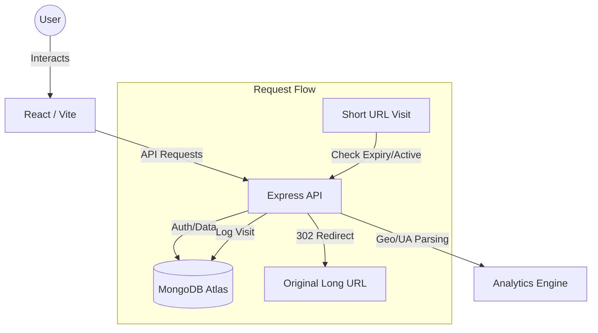

# 🔗 Forge Links


**Forge Links** is a modern, full-stack URL shortening and analytics platform designed for individuals and teams who need more than just a short link. It provides deep insights into traffic, customizable link behavior, and professional-grade management tools.

---

## 🚀 Features

-   **URL Shortening:** Transform long, cumbersome URLs into sleek, manageable links.
-   **Custom Aliases:** Create branded links with personalized slugs (e.g., `/my-brand`).
-   **QR Code Generation:** Every link automatically generates a high-quality QR code for offline sharing.
-   **Click Tracking:** Real-time monitoring of every interaction.
-   **Analytics Dashboard:** Comprehensive visual data including browser, OS, and device distribution.
-   **User Authentication:** Secure JWT-based registration and login system.
-   **Link Expiration:** Set "best before" dates for links to automatically revoke access.
-   **Profile Management:** Update account details and security credentials seamlessly.
-   **Activity Feed:** Keep track of recent clicks and link creations at a glance.
-   **Responsive Design:** Fully optimized for desktop, tablet, and mobile devices.

---

## 🛠 Tech Stack

| Component | Technology |
| :--- | :--- |
| **Frontend** | React 18, Vite, Tailwind CSS, Framer Motion |
| **Backend** | Node.js, Express 5 (Latest) |
| **Database** | MongoDB Atlas (Mongoose ODM) |
| **Authentication** | JSON Web Tokens (JWT), Bcrypt.js |
| **Charts** | Recharts |
| **Icons** | Lucide React |
| **Analytics** | UA-Parser-JS, GeoIP-lite |
| **Deployment** | Vercel (Frontend), Render (Backend) |

---

## 📐 Architecture Overview

Forge Links follows a decoupled Client-Server architecture. The React frontend communicates with a RESTful Express API.



### Key Workflows:
1.  **Authentication Flow:** Uses JWT stored in HTTP-only headers/local storage for secure session management.
2.  **Redirect Flow:** Optimized lookup with custom alias support and immediate 302 redirection.
3.  **Analytics Flow:** Non-blocking capture of User-Agent and IP-based geolocation data during redirection.

---

## 📂 Project Structure

```text
D:\LinkForge\
├── client/                # React Frontend
│   ├── src/
│   │   ├── components/    # Reusable UI & Layouts
│   │   ├── hooks/         # Custom React Hooks (useAuth, useAnalytics)
│   │   ├── pages/         # Page components (Dashboard, Analytics, etc.)
│   │   ├── context/       # State management (Shell, Theme)
│   │   └── lib/           # Utilities and API configurations
│   └── public/            # Static assets
└── server/                # Node.js Backend
    ├── src/
    │   ├── controllers/   # Request handlers (Auth, URL, Analytics)
    │   ├── models/        # Mongoose Schemas (User, Url, Visit)
    │   ├── routes/        # API Endpoints
    │   ├── middleware/    # Auth and validation logic
    │   └── config/        # DB and environment setup
    └── server.js          # Entry point
```

---

## ⚙️ Installation

### Prerequisites
-   Node.js (v18+)
-   MongoDB Atlas Account
-   npm or yarn

### Backend Setup
1.  Navigate to the server directory:
    ```bash
    cd server
    ```
2.  Install dependencies:
    ```bash
    npm install
    ```
3.  Create a `.env` file based on the environment variables section below.
4.  Start the development server:
    ```bash
    npm run dev
    ```

### Frontend Setup
1.  Navigate to the client directory:
    ```bash
    cd client
    ```
2.  Install dependencies:
    ```bash
    npm install
    ```
3.  Create a `.env` file.
4.  Start the frontend:
    ```bash
    npm run dev
    ```

---

## 🔑 Environment Variables

### Backend (`server/.env`)
| Variable | Description | Example |
| :--- | :--- | :--- |
| `PORT` | Server Port | `5000` |
| `MONGO_URI` | MongoDB Connection String | `mongodb+srv://...` |
| `JWT_SECRET` | Secret for token signing | `your_secret_key` |
| `FRONTEND_URL` | Allowed CORS origins | `http://localhost:5173` |
| `BASE_URL` | Production URL for links | `https://api.forge.links` |

### Frontend (`client/.env`)
| Variable | Description | Example |
| :--- | :--- | :--- |
| `VITE_API_URL` | Backend API Endpoint | `http://localhost:5000` |

---

## 📖 Usage Guide

1.  **Register/Login:** Create an account to access the secure dashboard.
2.  **Shorten Link:** Paste a long URL in the creator. Optionally add a **Custom Alias**.
3.  **Set Expiration:** Choose an optional date for the link to automatically expire.
4.  **Manage:** From the dashboard, view all your links, copy their short URLs, or download their QR codes.
5.  **Analyze:** Click on any link to view detailed charts showing traffic trends, top browsers, and device types.
6.  **Redirect:** Share your short link. Visitors are logged and then instantly sent to the destination.

---

## 🧠 AI Planning & Development

This project was developed using a "Design-First" approach assisted by advanced AI agents.

### Planning Process
-   **System Design:** AI tools were used to architect the data schemas and ensure optimal relationship mapping between Users and Visits.
-   **Decision Making:** Chose **Express 5** to leverage modern path-matching capabilities, despite the initial overhead of learning the new `path-to-regexp` v8 syntax.
-   **Security:** Implemented AI-reviewed validation patterns for custom aliases to prevent injection and naming collisions.

### Development Workflow
We utilized a surgical editing workflow, allowing for rapid iteration on features like the **CORS Preflight** handling and **Expiring Link Redirection**. AI assistance was pivotal in debugging the transition from legacy Express wildcards to the new named parameter syntax.

---

## 🛠 Assumptions Made

-   **Uniqueness:** Custom aliases must be globally unique across the platform.
-   **Analytics:** Every successful redirect is recorded; however, robots/crawlers are filtered where possible.
-   **Expiration:** Once a link expires, it redirects to a dedicated "Expired" page rather than just failing.
-   **Security:** Users can only view analytics and edit links that they have personally created.
-   **Privacy:** Geolocation is performed at the country/city level only, respecting user privacy.

---

## 🚧 Challenges Faced

-   **Express 5 Migration:** Moving to Express 5 required a complete rewrite of wildcard routes (`*`) to the new named parameter syntax (`{/*path}`).
-   **CORS Complexity:** Handling preflight `OPTIONS` requests across local and production environments required a robust, centralized CORS configuration.
-   **Real-time Redirection UX:** Ensuring that expired links provide a helpful UI card instead of a raw JSON error message was critical for the user experience.
-   **Data Consistency:** Managing click counts accurately while asynchronously logging detailed visit data.

---

## 🔮 Future Improvements

-   **Team Workspaces:** Collaborative link management for organizations.
-   **Custom Domains:** Allow users to connect their own domains (e.g., `links.mybrand.com`).
-   **Advanced Geo-Tracking:** Heatmaps for regional traffic analysis.
-   **Link Scheduling:** Define both "Start" and "End" dates for link activity.
-   **API Access:** Developer API keys for programmatically creating and managing links.

---

## 📽 Demo & Screenshots

### Live Demo
-   **Frontend:** [https://linkforge.vercel.app](https://link-forge-pi.vercel.app/)
-   **Backend:** [https://linkforge-api.render.com](https://linkforge-tdgx.onrender.com)

### Demo Video
-   **Loom Video:** [Watch the Walkthrough]((https://www.loom.com/share/30439f7474b749548c188f78245f0d73))
-   *Demonstrating: Link creation, Custom Alias validation, Expiration UI, and Analytics Dashboard.*

### Screenshots
| Dashboard | Analytics |
| :---: | :---: |
|  |  |

---

## 🤝 Contributors
-   **Pravin S** - *Full Stack Developer & Architect*

---

## 💖 Acknowledgements
-   Thanks to the **Katomaran** team for hosting the hackathon.
-   Inspiration from industry leaders like Bitly and Dub.co.

---

## This project is a part of a hackathon run by https://katomaran.com
